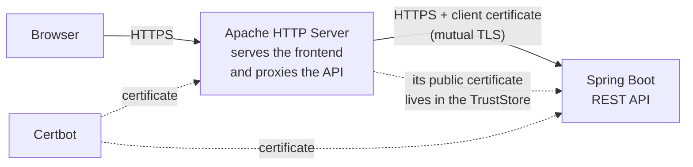

# SecureApp

**A web application encrypted end to end across two hops: browser to web server,
and web server to backend.** The second hop uses **mutual TLS**, so the backend
only serves a client that presents a certificate it recognises.

The subject of this project is secure transport and the configuration that holds
it together, not user management: authentication is deliberately minimal.

---

## Architecture



| Component | Technology | Role |
|---|---|---|
| Frontend | HTML + JavaScript | Asynchronous client using `fetch` |
| Web server | Apache HTTP Server 2.4 | Serves static files, reverse proxy |
| Backend | Spring Boot 4 + Spring Security | REST API, never directly exposed |
| Certificates | Certbot | TLS on both hops |
| Infrastructure | AWS EC2 | Two instances with Elastic IPs |

---

## Security measures

**Mutual TLS required, not merely requested.** The backend uses
`server.ssl.client-auth=need`. The difference from `want` is substantive: `want`
asks the client for a certificate but **accepts the connection anyway if none
arrives**, which means the control does not exist. With `need`, a request without
a certificate signed against the TrustStore is rejected during the handshake,
before it reaches the application.

**No cryptographic material or passwords in the repository.** The `tls` profile
reads paths and passwords from the environment and **defines no defaults**: if a
variable is missing the application refuses to start, rather than listening
without the configuration it is supposed to be using. `.gitignore` excludes
`.p12`, `.jks`, `.pem`, `.key`, `.crt` and `.cer`.

**Only the password hash is stored.** A BCrypt hash lives in configuration, never
the password. BCrypt carries its own salt and cost factor.

**The backend does not reveal which users exist.** An unknown user and a wrong
password return the same status and the same body. The hash is also always
evaluated even when the username does not match: short-circuiting before BCrypt
would make the response faster for unknown users, and that timing difference
would allow enumerating them.

**CORS with an explicit list.** Allowed origins are configured through the
environment. No wildcard, which would let any site call the API from a signed-in
user's browser.

**The backend is not directly reachable.** It sits behind the proxy, and its
security group only admits traffic from the Apache instance.

---

## Layout

```text
secureapp/
├── backend/
│   └── src/main/
│       ├── java/co/edu/escuelaing/secureapp/
│       │   ├── SecureappApplication.java
│       │   ├── AuthController.java      # /api/login and /api/health
│       │   └── SecurityConfig.java      # filter chain, CORS, BCrypt
│       └── resources/
│           ├── application.properties       # default profile: HTTP
│           └── application-tls.properties   # TLS and mutual TLS, from the environment
└── frontend/
    └── index.html
```

---

## Running it locally

The default profile starts on plain HTTP, without certificates, so the project
can be developed and tested locally.

```bash
cd backend
./mvnw spring-boot:run
```

```bash
curl http://localhost:8080/api/health
```

```bash
curl -X POST http://localhost:8080/api/login -H "Content-Type: application/json" -d "{\"username\":\"admin\",\"password\":\"devpassword\"}"
```

### Credentials

The demonstration account is configured through the environment:

| Variable | Description | Default |
|---|---|---|
| `APP_AUTH_USERNAME` | Username | `admin` |
| `APP_AUTH_PASSWORD_HASH` | BCrypt hash of the password | hash of `devpassword` |
| `APP_CORS_ALLOWED_ORIGINS` | Allowed origins, comma separated | `http://localhost:5173,http://localhost:8080` |

A new hash comes from `BCryptPasswordEncoder().encode(...)`; the result goes into
`APP_AUTH_PASSWORD_HASH`. The plaintext password is written to no file in the
project.

---

## Tests

```bash
cd backend
./mvnw test
```

10 tests over the security behaviour: valid and invalid credentials, absence of
leakage about which users exist, requests without credentials, never echoing the
password back, denial of paths that are not explicitly public, and CORS accepting
the configured origin while rejecting any other.

---

## Deploying with TLS

The `tls` profile requires these variables:

| Variable | Description |
|---|---|
| `SSL_KEYSTORE_PATH` | Path to the PKCS12 holding the backend certificate |
| `SSL_KEYSTORE_PASSWORD` | KeyStore password |
| `SSL_TRUSTSTORE_PATH` | Path to the PKCS12 holding Apache's public certificate |
| `SSL_TRUSTSTORE_PASSWORD` | TrustStore password |
| `SSL_KEY_ALIAS` | Key alias (defaults to `tomcat`) |

### Server 1 — Apache

```bash
sudo yum install -y httpd mod_ssl certbot
sudo certbot certonly --standalone -d your-domain.duckdns.org
```

Build the PKCS12 Apache will present to the backend, and export its public
certificate:

```bash
sudo openssl pkcs12 -export -in /etc/letsencrypt/live/your-domain.duckdns.org/fullchain.pem -inkey /etc/letsencrypt/live/your-domain.duckdns.org/privkey.pem -out /home/ec2-user/apache-keystore.p12 -name apache
```

```bash
sudo openssl x509 -in /etc/letsencrypt/live/your-domain.duckdns.org/fullchain.pem -out /home/ec2-user/apache-cert.cer
```

Reverse proxy in `/etc/httpd/conf.d/proxy.conf`:

```apache
SSLProxyEngine on

# Apache validates the backend certificate too. With SSLProxyVerify none the
# traffic would still be encrypted but nothing would confirm who is on the
# other end, which is exactly what mutual TLS is meant to prevent.
SSLProxyVerify require
SSLProxyCACertificateFile /etc/pki/tls/certs/backend-ca.pem

SSLProxyMachineCertificateFile /home/ec2-user/apache-keystore.p12

ProxyPass /api https://your-backend.duckdns.org/api
ProxyPassReverse /api https://your-backend.duckdns.org/api
```

### Server 2 — Spring Boot

```bash
sudo yum install -y java-17-amazon-corretto
sudo certbot certonly --standalone -d your-backend.duckdns.org
```

Import Apache's public certificate into the TrustStore:

```bash
keytool -import -file /home/ec2-user/apache-cert.cer -alias apache -keystore /home/ec2-user/truststore.p12 -storetype PKCS12 -noprompt
```

Service unit in `/etc/systemd/system/secureapp.service`:

```ini
[Unit]
Description=SecureApp Spring Boot Backend
After=network.target

[Service]
Type=simple
User=secureapp
Environment="SPRING_PROFILES_ACTIVE=tls"
Environment="SERVER_PORT=8443"
EnvironmentFile=/etc/secureapp/secrets.env
ExecStart=/usr/bin/java -jar /opt/secureapp/secureapp.jar
Restart=always
RestartSec=10

[Install]
WantedBy=multi-user.target
```

`/etc/secureapp/secrets.env` holds the variables from the table above and should
be mode `600`. The service runs as its own user and listens on 8443: binding port
443 would require root privileges for the whole process.

---

## Known limitations

- **Login neither opens a session nor issues a token.** It validates credentials
  and answers, but hands back nothing the client can present afterwards. As a
  result `anyRequest().authenticated()` cannot be satisfied and those paths answer
  403. The project demonstrates transport security, not session management;
  adding it would mean issuing a JWT or opening a server session.
- **A single account, defined in configuration.** No registration, no roles, no
  user store.
- **No login attempt limit.** Nothing prevents trying passwords repeatedly. This
  is the most relevant gap for production use.
- **CSRF disabled.** Consistent while no session cookies exist, since the browser
  attaches no credentials automatically. Adding cookie-based sessions would
  require turning it back on.
- **Certificate renewal is manual.** Certificates expire every 90 days and no
  automatic renewal is configured.
- **Mutual TLS has only been exercised in deployment.** The automated tests run on
  the HTTP profile; verifying the mutual handshake would require generating test
  cryptographic material during the build.
