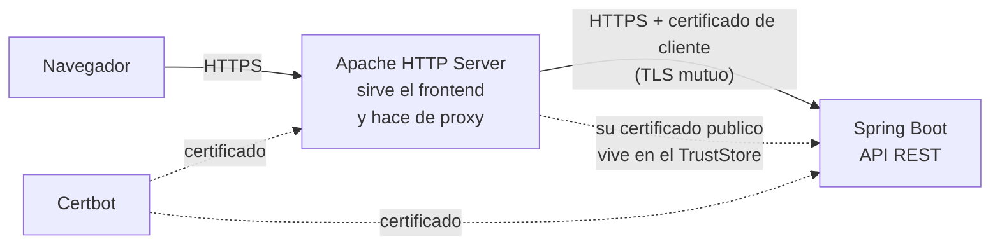

# SecureApp

Aplicacion web que cifra el trafico de extremo a extremo en dos saltos: del
navegador al servidor web, y del servidor web al backend. El segundo salto usa
**TLS mutuo**, de modo que el backend solo atiende a un cliente que presente un
certificado que el reconoce.

El objetivo del proyecto es el transporte seguro y la configuracion que lo
sostiene, no la gestion de usuarios: la autenticacion es deliberadamente minima.

---

## Arquitectura



| Componente | Tecnologia | Rol |
|---|---|---|
| Frontend | HTML + JavaScript | Cliente asincrono con `fetch` |
| Servidor web | Apache HTTP Server 2.4 | Sirve estaticos y hace proxy inverso |
| Backend | Spring Boot 4 + Spring Security | API REST, nunca expuesta directamente |
| Certificados | Certbot | TLS en ambos saltos |
| Infraestructura | AWS EC2 | Dos instancias con Elastic IP |

---

## Medidas de seguridad

**TLS mutuo exigido, no solicitado.** El backend usa `server.ssl.client-auth=need`.
La diferencia con `want` es sustantiva: `want` pide el certificado al cliente pero
**acepta la conexion igualmente si no llega**, con lo cual el control no existe.
Con `need`, una peticion que no presente un certificado firmado por el TrustStore
se rechaza durante el handshake, antes de alcanzar la aplicacion.

**Sin material criptografico ni contrasenas en el repositorio.** El perfil `tls`
lee rutas y contrasenas del entorno y **no define valores por defecto**: si falta
una variable la aplicacion no arranca, en lugar de quedarse escuchando sin la
configuracion que se supone que debe usar. El `.gitignore` excluye `.p12`, `.jks`,
`.pem`, `.key`, `.crt` y `.cer`.

**Solo se almacena el hash de la contrasena.** Se guarda un hash BCrypt en
configuracion, nunca la contrasena. BCrypt incorpora sal y factor de coste.

**El backend no revela que usuarios existen.** Un usuario inexistente y una
contrasena incorrecta devuelven el mismo codigo y el mismo cuerpo. Ademas se
evalua siempre el hash aunque el usuario no coincida: cortocircuitar antes de
BCrypt haria que la respuesta fuese mas rapida para usuarios inexistentes, y esa
diferencia de tiempo permitiria enumerarlos.

**CORS con lista explicita.** Los origenes autorizados se configuran por entorno.
No se usa comodin, que permitiria a cualquier sitio invocar la API desde el
navegador de un usuario.

**El backend no es alcanzable directamente.** Queda detras del proxy, y el grupo
de seguridad solo admite trafico procedente de la instancia de Apache.

---

## Estructura

```text
secureapp/
├── backend/
│   └── src/main/
│       ├── java/co/edu/escuelaing/secureapp/
│       │   ├── SecureappApplication.java
│       │   ├── AuthController.java      # /api/login y /api/health
│       │   └── SecurityConfig.java      # cadena de filtros, CORS, BCrypt
│       └── resources/
│           ├── application.properties       # perfil por defecto: HTTP
│           └── application-tls.properties   # TLS y TLS mutuo, por entorno
└── frontend/
    └── index.html
```

---

## Ejecucion local

El perfil por defecto arranca en HTTP plano, sin certificados, para poder
desarrollar y ejecutar las pruebas.

```bash
cd secureapp/backend
./mvnw spring-boot:run
```

```bash
curl http://localhost:8080/api/health
```

```bash
curl -X POST http://localhost:8080/api/login -H "Content-Type: application/json" -d "{\"username\":\"admin\",\"password\":\"devpassword\"}"
```

### Credenciales

La cuenta de demostracion se configura por entorno:

| Variable | Descripcion | Valor por defecto |
|---|---|---|
| `APP_AUTH_USERNAME` | Usuario | `admin` |
| `APP_AUTH_PASSWORD_HASH` | Hash BCrypt de la contrasena | hash de `devpassword` |
| `APP_CORS_ALLOWED_ORIGINS` | Origenes permitidos, separados por coma | `http://localhost:5173,http://localhost:8080` |

Para generar un hash nuevo basta con `BCryptPasswordEncoder().encode(...)`; el
resultado se pasa en `APP_AUTH_PASSWORD_HASH`. La contrasena en claro no se
escribe en ningun archivo del proyecto.

---

## Pruebas

```bash
cd secureapp/backend
./mvnw test
```

10 pruebas sobre el comportamiento de seguridad: credenciales validas e
invalidas, ausencia de filtracion sobre que usuarios existen, rechazo de peticion
sin credenciales, que la respuesta nunca devuelve la contrasena, que las rutas no
declaradas publicas quedan denegadas, y que CORS acepta el origen configurado y
rechaza cualquier otro.

---

## Despliegue con TLS

El perfil `tls` exige estas variables:

| Variable | Descripcion |
|---|---|
| `SSL_KEYSTORE_PATH` | Ruta al PKCS12 con el certificado del backend |
| `SSL_KEYSTORE_PASSWORD` | Contrasena del KeyStore |
| `SSL_TRUSTSTORE_PATH` | Ruta al PKCS12 con el certificado publico de Apache |
| `SSL_TRUSTSTORE_PASSWORD` | Contrasena del TrustStore |
| `SSL_KEY_ALIAS` | Alias de la clave (por defecto `tomcat`) |

### Servidor 1 — Apache

```bash
sudo yum install -y httpd mod_ssl certbot
sudo certbot certonly --standalone -d tu-dominio.duckdns.org
```

Generar el PKCS12 que Apache presentara al backend y exportar su certificado
publico:

```bash
sudo openssl pkcs12 -export -in /etc/letsencrypt/live/tu-dominio.duckdns.org/fullchain.pem -inkey /etc/letsencrypt/live/tu-dominio.duckdns.org/privkey.pem -out /home/ec2-user/apache-keystore.p12 -name apache
```

```bash
sudo openssl x509 -in /etc/letsencrypt/live/tu-dominio.duckdns.org/fullchain.pem -out /home/ec2-user/apache-cert.cer
```

Proxy inverso en `/etc/httpd/conf.d/proxy.conf`:

```apache
SSLProxyEngine on

# Apache tambien valida el certificado del backend. Con SSLProxyVerify none
# el cifrado seguiria activo pero no se comprobaria contra quien se habla,
# que es justo lo que el TLS mutuo pretende evitar.
SSLProxyVerify require
SSLProxyCACertificateFile /etc/pki/tls/certs/backend-ca.pem

SSLProxyMachineCertificateFile /home/ec2-user/apache-keystore.p12

ProxyPass /api https://tu-backend.duckdns.org/api
ProxyPassReverse /api https://tu-backend.duckdns.org/api
```

### Servidor 2 — Spring Boot

```bash
sudo yum install -y java-17-amazon-corretto
sudo certbot certonly --standalone -d tu-backend.duckdns.org
```

Importar el certificado publico de Apache al TrustStore:

```bash
keytool -import -file /home/ec2-user/apache-cert.cer -alias apache -keystore /home/ec2-user/truststore.p12 -storetype PKCS12 -noprompt
```

Servicio en `/etc/systemd/system/secureapp.service`:

```ini
[Unit]
Description=SecureApp Spring Boot Backend
After=network.target

[Service]
Type=simple
User=secureapp
Environment="SPRING_PROFILES_ACTIVE=tls"
Environment="SERVER_PORT=8443"
EnvironmentFile=/etc/secureapp/secrets.env
ExecStart=/usr/bin/java -jar /opt/secureapp/secureapp.jar
Restart=always
RestartSec=10

[Install]
WantedBy=multi-user.target
```

`/etc/secureapp/secrets.env` contiene las variables de la tabla anterior y debe
tener permisos `600`. El servicio corre con un usuario propio y escucha en 8443:
enlazar el puerto 443 exigiria privilegios de root para todo el proceso.

---

## Limitaciones conocidas

- **El login no abre sesion ni emite token.** Valida credenciales y responde, pero
  no entrega nada que el cliente pueda presentar despues. En consecuencia
  `anyRequest().authenticated()` no puede satisfacerse y esas rutas responden 403.
  El proyecto demuestra seguridad de transporte, no gestion de sesiones; anadirla
  significaria emitir un JWT o abrir sesion de servidor.
- **Una sola cuenta, definida en configuracion.** No hay registro, ni roles, ni
  almacen de usuarios.
- **Sin limite de intentos de login.** Nada impide probar contrasenas de forma
  repetida. Es la carencia mas relevante de cara a produccion.
- **CSRF desactivado.** Es coherente mientras no existan cookies de sesion, ya que
  el navegador no adjunta credenciales automaticamente. Si se anadiera sesion por
  cookie, habria que reactivarlo.
- **La renovacion de certificados es manual.** Los certificados caducan cada 90
  dias y no hay renovacion automatica configurada.
- **El TLS mutuo solo se ha comprobado en despliegue.** Las pruebas automatizadas
  corren sobre el perfil HTTP; verificar el handshake mutuo exigiria generar
  material criptografico de prueba durante el build.
